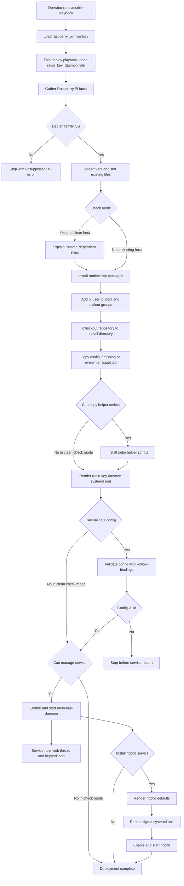

# Ansible Deploy Flow

```mermaid
flowchart TD
    Operator[Operator runs ansible-playbook] --> Inventory[Load raspberry_pi inventory]
    Inventory --> Playbook[Thin deploy playbook loads radio_key_daemon role]
    Playbook --> Facts[Gather Raspberry Pi facts]
    Facts --> Debian{Debian family OS}
    Debian -->|No| StopUnsupported[Stop with unsupported OS error]
    Debian -->|Yes| Preflight[Assert vars and stat existing files]
    Preflight --> CheckMode{Check mode}
    CheckMode -->|Yes and clean host| ExplainSkip[Explain runtime-dependent skips]
    ExplainSkip --> Packages
    CheckMode -->|No or existing host| Packages[Install runtime apt packages]
    Packages --> UserGroups[Add pi user to input and dialout groups]
    UserGroups --> Checkout[Checkout repository to install directory]
    Checkout --> Config[Copy config if missing or overwrite requested]
    Config --> Helpers{Can copy helper scripts}
    Helpers -->|No in clean check mode| Unit
    Helpers -->|Yes| HelperCopy[Install radio helper scripts]
    HelperCopy --> Unit[Render radio-key-daemon systemd unit]
    Unit --> Validate{Can validate config}
    Validate -->|No in clean check mode| StartDecision
    Validate -->|Yes| ValidateCommand[Validate config with --show-bindings]
    ValidateCommand --> Valid{Config valid}
    Valid -->|No| StopInvalid[Stop before service restart]
    Valid -->|Yes| StartDecision{Can manage service}
    StartDecision -->|No in check mode| Done[Deployment plan complete]
    StartDecision -->|Yes| StartService[Enable and start radio-key-daemon]
    StartService --> WebAndKeypad[Service runs web thread and keypad loop]
    StartService --> OptionalRig{Install rigctld service}
    OptionalRig -->|No| Done[Deployment complete]
    OptionalRig -->|Yes| RigDefaults[Render rigctld defaults]
    RigDefaults --> RigUnit[Render rigctld systemd unit]
    RigUnit --> RigStart[Enable and start rigctld]
    RigStart --> Done
```
