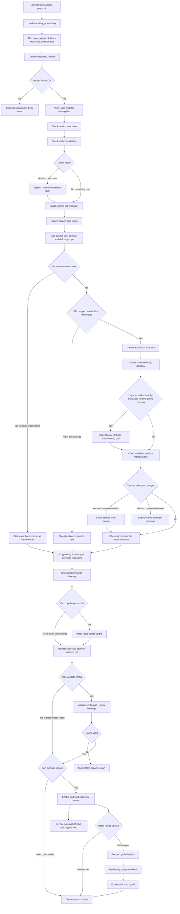

# Ansible Deploy Flow

```mermaid
flowchart TD
    Operator[Operator runs ansible-playbook] --> Inventory[Load raspberry_pi inventory]
    Inventory --> Playbook[Thin deploy playbook loads radio_key_daemon role]
    Playbook --> Facts[Gather Raspberry Pi facts]
    Facts --> Debian{Debian family OS}
    Debian -->|No| StopUnsupported[Stop with unsupported OS error]
    Debian -->|Yes| Preflight[Assert vars and stat existing files]
    Preflight --> UserLookup[Check service user state]
    UserLookup --> AclLookup[Check setfacl availability]
    AclLookup --> CheckMode{Check mode}
    CheckMode -->|Yes and clean host| ExplainSkip[Explain runtime-dependent skips]
    ExplainSkip --> Packages
    CheckMode -->|No or existing host| Packages[Install runtime apt packages]
    Packages --> EnsureUser[Ensure service user exists]
    EnsureUser --> UserGroups[Add service user to input and dialout groups]
    UserGroups --> UserReady{Service user exists now}
    UserReady -->|No in clean check mode| SkipUserTasks[Skip tasks that must run as service user]
    UserReady -->|Yes| AclReady{ACL support available or real deploy}
    AclReady -->|No in check mode| SkipCheckout[Skip checkout as service user]
    AclReady -->|Yes| AppDir[Create application directory]
    AppDir --> ConfigDir[Create runtime config directory]
    ConfigDir --> LegacyConfig{Legacy checkout config exists and runtime config missing}
    LegacyConfig -->|Yes| MigrateConfig[Copy legacy config to runtime config path]
    LegacyConfig -->|No| DirtyCheck
    MigrateConfig --> DirtyCheck[Check tracked checkout modifications]
    DirtyCheck --> DirtyCheckout{Tracked checkout changes}
    DirtyCheckout -->|Yes and preserve enabled| StashChanges[Stash tracked local changes]
    DirtyCheckout -->|Yes and preserve disabled| StopDirty[Stop with dirty checkout message]
    DirtyCheckout -->|No| Checkout[Checkout repository to install directory]
    StashChanges --> Checkout
    SkipUserTasks --> Config
    SkipCheckout --> Config
    Checkout --> Config[Copy config if missing or overwrite requested]
    Config --> HelperSource[Check helper source directory]
    HelperSource --> Helpers{Can copy helper scripts}
    Helpers -->|No in clean check mode| Unit
    Helpers -->|Yes| HelperCopy[Install radio helper scripts]
    HelperCopy --> Unit[Render radio-key-daemon systemd unit]
    Unit --> Validate{Can validate config}
    Validate -->|No in clean check mode| StartDecision
    Validate -->|Yes| ValidateCommand[Validate config with --show-bindings]
    ValidateCommand --> Valid{Config valid}
    Valid -->|No| StopInvalid[Stop before service restart]
    Valid -->|Yes| StartDecision{Can manage service}
    StartDecision -->|No in check mode| Done[Deployment plan complete]
    StartDecision -->|Yes| StartService[Enable and start radio-key-daemon]
    StartService --> WebAndKeypad[Service runs web thread and keypad loop]
    StartService --> RigDecision{Install rigctld service}
    RigDecision -->|No override| Done[Deployment complete]
    RigDecision -->|Default yes| RigDefaults[Render rigctld defaults]
    RigDefaults --> RigUnit[Render rigctld systemd unit]
    RigUnit --> RigStart[Enable and start rigctld]
    RigStart --> Done
```
