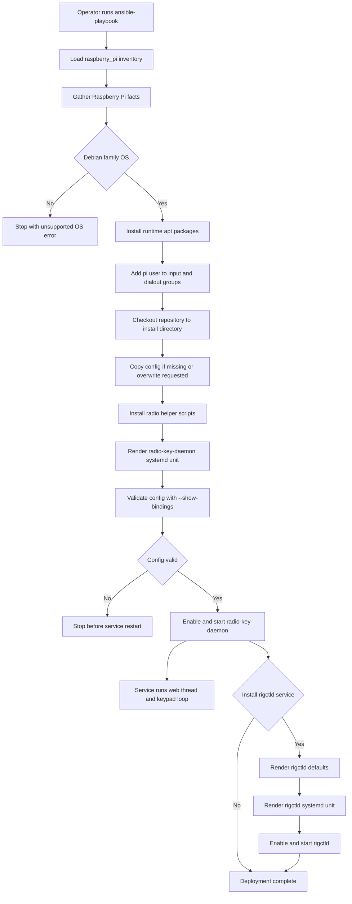

# Ansible Deploy Flow

```mermaid
flowchart TD
    Operator[Operator runs ansible-playbook] --> Inventory[Load raspberry_pi inventory]
    Inventory --> Facts[Gather Raspberry Pi facts]
    Facts --> Debian{Debian family OS}
    Debian -->|No| StopUnsupported[Stop with unsupported OS error]
    Debian -->|Yes| Packages[Install runtime apt packages]
    Packages --> UserGroups[Add pi user to input and dialout groups]
    UserGroups --> Checkout[Checkout repository to install directory]
    Checkout --> Config[Copy config if missing or overwrite requested]
    Config --> Helpers[Install radio helper scripts]
    Helpers --> Unit[Render radio-key-daemon systemd unit]
    Unit --> Validate[Validate config with --show-bindings]
    Validate --> Valid{Config valid}
    Valid -->|No| StopInvalid[Stop before service restart]
    Valid -->|Yes| StartService[Enable and start radio-key-daemon]
    StartService --> WebAndKeypad[Service runs web thread and keypad loop]
    StartService --> OptionalRig{Install rigctld service}
    OptionalRig -->|No| Done[Deployment complete]
    OptionalRig -->|Yes| RigDefaults[Render rigctld defaults]
    RigDefaults --> RigUnit[Render rigctld systemd unit]
    RigUnit --> RigStart[Enable and start rigctld]
    RigStart --> Done
```
