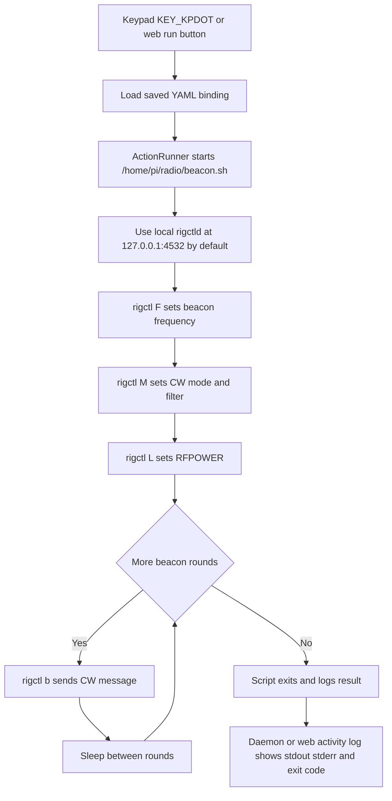

# CW Beacon Flow

```mermaid
flowchart TD
    Start[Keypad KEY_KPDOT or web run button] --> Lookup[Load saved YAML binding]
    Lookup --> Runner[ActionRunner starts /home/pi/radio/beacon.sh]
    Runner --> Endpoint[Use local rigctld at 127.0.0.1:4532 by default]
    Endpoint --> SetFreq[rigctl F sets beacon frequency]
    SetFreq --> SetMode[rigctl M sets CW mode and filter]
    SetMode --> SetPower[rigctl L sets RFPOWER]
    SetPower --> Loop{More beacon rounds}
    Loop -->|Yes| SendBeacon[rigctl b sends CW message]
    SendBeacon --> Pause[Sleep between rounds]
    Pause --> Loop
    Loop -->|No| Complete[Script exits and logs result]
    Complete --> UiLog[Daemon or web activity log shows stdout stderr and exit code]
```
