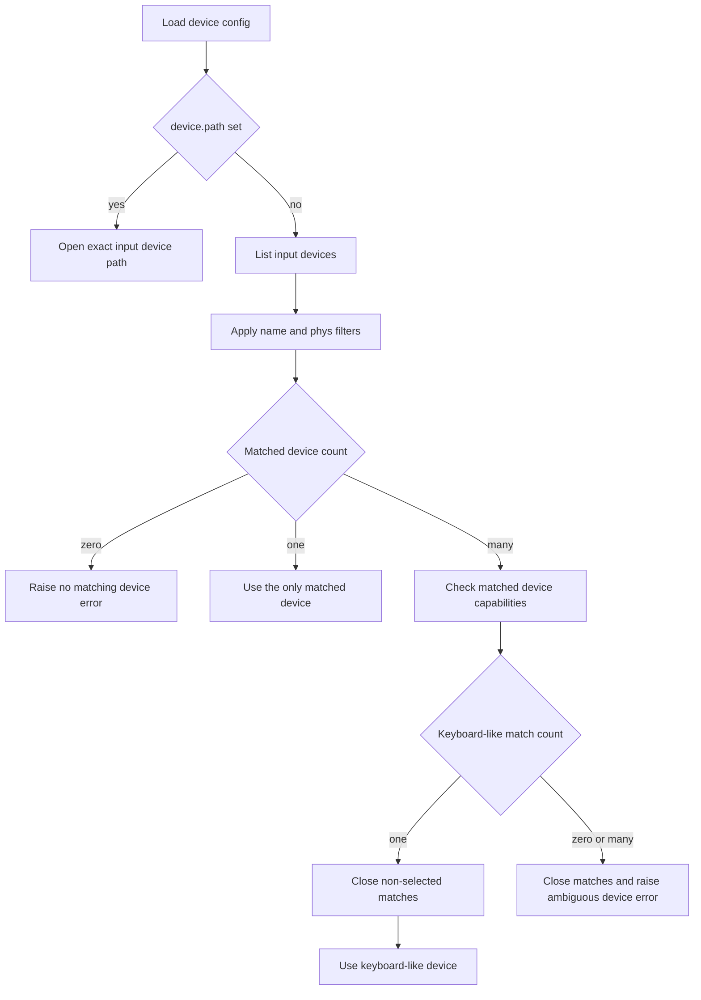

# Input Device Selection Flow

```mermaid
flowchart TD
    Start[Load device config] --> PathSet{device.path set}
    PathSet -->|yes| OpenPath[Open exact input device path]
    PathSet -->|no| ListDevices[List input devices]
    ListDevices --> MatchFilters[Apply name and phys filters]
    MatchFilters --> MatchCount{Matched device count}
    MatchCount -->|zero| NoMatch[Raise no matching device error]
    MatchCount -->|one| UseOnly[Use the only matched device]
    MatchCount -->|many| KeyboardFilter[Check matched device capabilities]
    KeyboardFilter --> KeyboardCount{Keyboard-like match count}
    KeyboardCount -->|one| CloseOthers[Close non-selected matches]
    CloseOthers --> UseKeyboard[Use keyboard-like device]
    KeyboardCount -->|zero or many| Ambiguous[Close matches and raise ambiguous device error]
```
