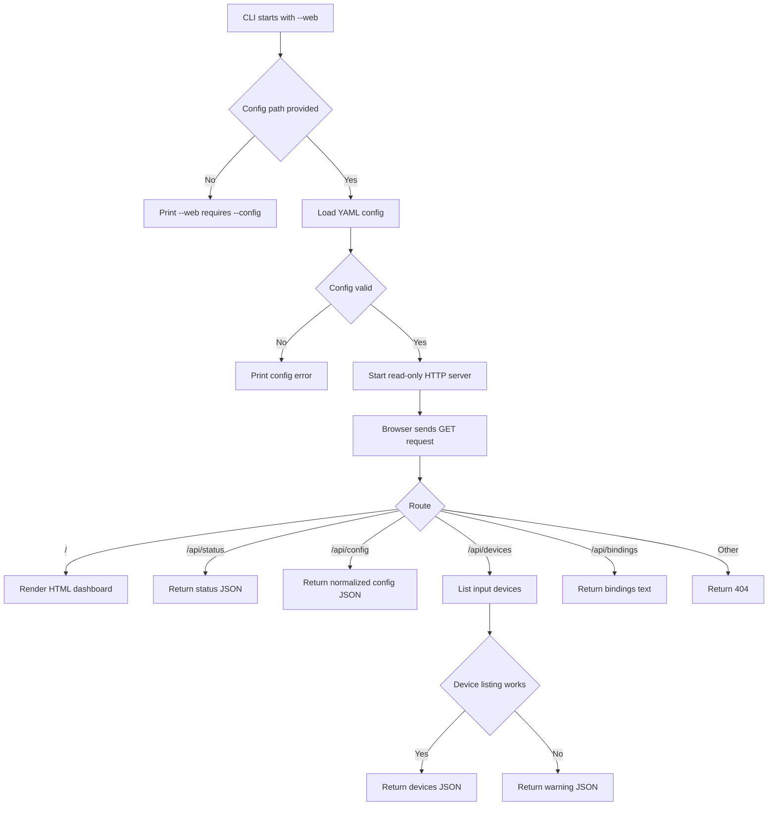

# Web Interface Flow

```mermaid
flowchart TD
    Start[CLI starts with --web] --> NeedConfig{Config path provided}
    NeedConfig -->|No| ConfigError[Print --web requires --config]
    NeedConfig -->|Yes| LoadConfig[Load YAML config]
    LoadConfig --> ValidConfig{Config valid}
    ValidConfig -->|No| PrintError[Print config error]
    ValidConfig -->|Yes| StartServer[Start read-only HTTP server]
    StartServer --> Request[Browser sends GET request]
    Request --> Route{Route}
    Route -->|/| Dashboard[Render HTML dashboard]
    Route -->|/api/status| Status[Return status JSON]
    Route -->|/api/config| Config[Return normalized config JSON]
    Route -->|/api/devices| Devices[List input devices]
    Devices --> DeviceOk{Device listing works}
    DeviceOk -->|Yes| DeviceJson[Return devices JSON]
    DeviceOk -->|No| DeviceWarning[Return warning JSON]
    Route -->|/api/bindings| Bindings[Return bindings text]
    Route -->|Other| NotFound[Return 404]
```
