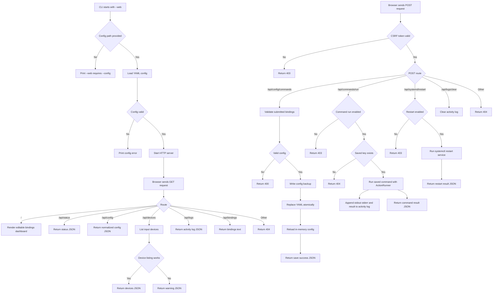

# Web Interface Flow

```mermaid
flowchart TD
    Start[CLI starts with --web] --> NeedConfig{Config path provided}
    NeedConfig -->|No| ConfigError[Print --web requires --config]
    NeedConfig -->|Yes| LoadConfig[Load YAML config]
    LoadConfig --> ValidConfig{Config valid}
    ValidConfig -->|No| PrintError[Print config error]
    ValidConfig -->|Yes| StartServer[Start HTTP server]
    StartServer --> Request[Browser sends GET request]
    Request --> Route{Route}
    Route -->|/| Dashboard[Render editable bindings dashboard]
    Route -->|/api/status| Status[Return status JSON]
    Route -->|/api/config| Config[Return normalized config JSON]
    Route -->|/api/devices| Devices[List input devices]
    Route -->|/api/logs| Logs[Return activity log JSON]
    Devices --> DeviceOk{Device listing works}
    DeviceOk -->|Yes| DeviceJson[Return devices JSON]
    DeviceOk -->|No| DeviceWarning[Return warning JSON]
    Route -->|/api/bindings| Bindings[Return bindings text]
    Route -->|Other| NotFound[Return 404]

    BrowserPost[Browser sends POST request] --> Csrf{CSRF token valid}
    Csrf -->|No| Forbidden[Return 403]
    Csrf -->|Yes| PostRoute{POST route}
    PostRoute -->|/api/config/commands| ValidateBindings[Validate submitted bindings]
    ValidateBindings --> ValidBindings{Valid config}
    ValidBindings -->|No| SaveRejected[Return 400]
    ValidBindings -->|Yes| Backup[Write config backup]
    Backup --> AtomicWrite[Replace YAML atomically]
    AtomicWrite --> ReloadConfig[Reload in-memory config]
    ReloadConfig --> SaveOk[Return save success JSON]

    PostRoute -->|/api/commands/run| RunAllowed{Command run enabled}
    RunAllowed -->|No| RunForbidden[Return 403]
    RunAllowed -->|Yes| FindCommand{Saved key exists}
    FindCommand -->|No| RunNotFound[Return 404]
    FindCommand -->|Yes| RunCommand[Run saved command with ActionRunner]
    RunCommand --> LogRun[Append stdout stderr and result to activity log]
    RunCommand --> RunResult[Return command result JSON]

    PostRoute -->|/api/systemd/restart| RestartAllowed{Restart enabled}
    RestartAllowed -->|No| RestartForbidden[Return 403]
    RestartAllowed -->|Yes| RestartService[Run systemctl restart service]
    RestartService --> RestartResult[Return restart result JSON]
    PostRoute -->|/api/logs/clear| ClearLogs[Clear activity log]
    PostRoute -->|Other| PostNotFound[Return 404]
```
